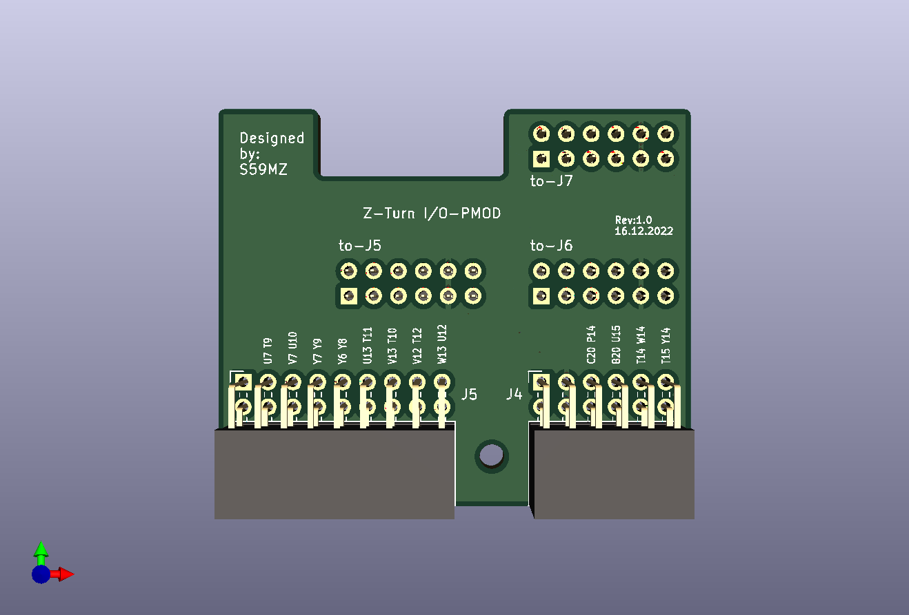

# z_pmod
Adaptor from Z-Turn I/O Extension board to PMOD interfaces only

Schematic:
[z_pmod.pdf](z_pmod.pdf)

BOM:
[z_pmod.csv](z_pmod.csv)

Gerbers:
[gerbers.zip](https://github.com/s59mz/kicad-z_pmod/raw/main/gerbers.zip)
